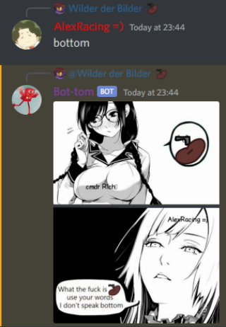

# Bot-Tom

## Overview

Bot-Tom is a discord bot that enables you to call your friends' emote usage into question.

All you have to do is reply to a message which contains an Emoji with the word "bottom" and the bot will generate you an image like:


And it will send it as a reply to the **original message** like this:



It also works with gif emotes!

### Soft Bottom

Now also supports a second template triggered by typing softbottom instead of bottom:


## Getting Started
### Prerequisites

- A [discord bot](https://discordpy.readthedocs.io/en/stable/discord.html) with the "Message Content Intent" is required. Intents can be toggled in the Bot section of your Application in the [Discord Developer Portal](https://discord.com/developers/applications).
- You also need at least Python3.9 and pip installed.

### Usage

Required packages are documented in [requirements.txt](requirements.txt) and can be installed like:

```shell script
pip install -r requirements.txt
```

The program can then be started like:

```shell script
python3 path/to/bottom_meme.py token
```
And replacing "token" with your bot token.

Resources for running as a docker container are also included.

## Known Bugs

- Flags are not detected
- Multi-emote combinations are [funky](screenshots/combinedEmoteFunkiness.png)
- Custom emotes are checked before default emotes
- special characters in names are not printed correctly

## Contributing

Contributions are what make the open source community such an amazing place to learn, inspire, and create. Any contributions you make are **greatly appreciated**.

If you have a suggestion that would make this better, please fork the repo and create a pull request. You can also simply open an issue with the tag "enhancement".
Don't forget to give the project a star! Thanks again!

1. Fork the Project
2. Create your Feature Branch (`git checkout -b feature/AmazingFeature`)
3. Commit your Changes (`git commit -m 'Add some AmazingFeature'`)
4. Push to the Branch (`git push origin feature/AmazingFeature`)
5. Open a Pull Request
